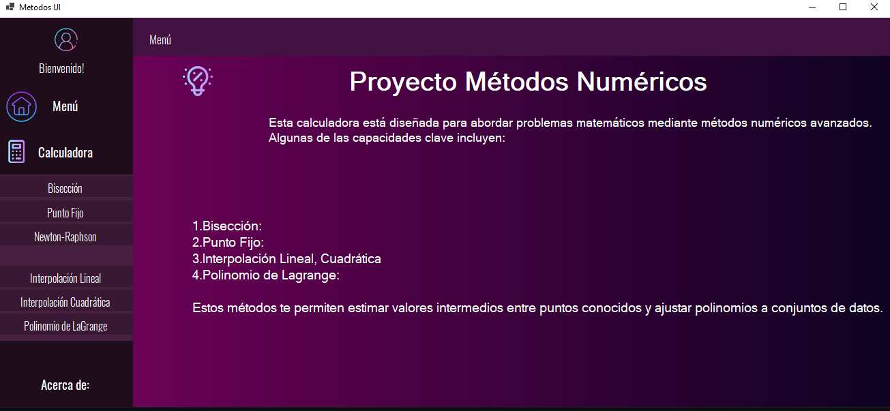

    <h1>Calculadora de Métodos Numéricos Avanzados</h1>

    

## Bisección
El método de Bisección es implementado en C# y toma como parámetros una función a resolver, los valores iniciales del intervalo y el número máximo de iteraciones. El método utiliza la bisección iterativa para encontrar la raíz de la función, calculando el punto medio del intervalo en cada iteración y actualizando el intervalo según el signo de la función en ese punto medio.

## Punto Fijo
El método de Punto Fijo es implementado en C# y toma como parámetros la función a resolver, el valor inicial y el número máximo de iteraciones. Este método resuelve ecuaciones no lineales de manera iterativa, actualizando el valor de la aproximación en cada iteración basándose en la evaluación de la función en el valor anterior.

## Newton-Raphson
El método de Newton-Raphson es implementado en C# y toma como parámetros la función a resolver y el valor inicial. Al igual que el Punto Fijo, resuelve ecuaciones no lineales de manera iterativa, utilizando la derivada de la función para calcular el nuevo valor de la aproximación en cada iteración.

Además de estos métodos, el proyecto también incluye implementaciones para la interpolación lineal, interpolación cuadrática y el polinomio interpolador de Lagrange, cada uno con su respectiva explicación y código en C#. Estos métodos permiten estimar valores y construir polinomios interpoladores utilizando conjuntos de puntos proporcionados por el usuario.

</body>
</html>
